## What is Transaction Management?

Transaction Management is an application to manage bank transactions.


[](https://github.com/leakeyash/TransacationManagement/actions/workflows/maven.yml)

## Get Start

- JDK21
- Spring Boot 3.5
- Maven 3.9
- Spock Testing Framework

Once launched, the start page will be available at localhost:8080.

## Dependencies

- Add MyBatis-Plus dependency
    - SpringBoot3
      ```xml
       <!-- Spring Web -->
       <dependency>
            <groupId>org.springframework.boot</groupId>
            <artifactId>spring-boot-starter-web</artifactId>
        </dependency>
        <dependency>
            <groupId>org.springframework.boot</groupId>
            <artifactId>spring-boot-starter-validation</artifactId>
        </dependency>
        <dependency>
            <groupId>org.springframework.boot</groupId>
            <artifactId>spring-boot-starter-actuator</artifactId>
        </dependency>
        <!-- Spring JPA -->
        <dependency>
            <groupId>org.springframework.boot</groupId>
            <artifactId>spring-boot-starter-data-jpa</artifactId>
        </dependency>
        <!-- Spring Cache with caffeine implementation -->
        <dependency>
            <groupId>org.springframework.boot</groupId>
            <artifactId>spring-boot-starter-cache</artifactId>
        </dependency>
        <dependency>
            <groupId>com.github.ben-manes.caffeine</groupId>
            <artifactId>caffeine</artifactId>
        </dependency>
      ```
    - Swagger and Open API
      ```xml
        <dependency>
            <groupId>org.springdoc</groupId>
            <artifactId>springdoc-openapi-starter-webmvc-ui</artifactId>
            <version>2.8.9</version>
        </dependency>
      ```
    - H2 Base as Memory Base
      ```xml
        <dependency>
            <groupId>com.h2database</groupId>
            <artifactId>h2</artifactId>
            <scope>runtime</scope>
        </dependency>
      ```
    - lombok
      ```xml
        <dependency>
            <groupId>org.projectlombok</groupId>
            <artifactId>lombok</artifactId>
            <optional>true</optional>
        </dependency>
      ```
    - Spock test framework
        ```xml
        <dependency>
            <groupId>org.spockframework</groupId>
            <artifactId>spock-core</artifactId>
            <scope>test</scope>
        </dependency>
        <dependency>
            <groupId>org.spockframework</groupId>
            <artifactId>spock-spring</artifactId>
            <scope>test</scope>
        </dependency>
        ```
## Jmeter Testing

- Worst case, get page(100) and post new transactions  
    - Get paged result
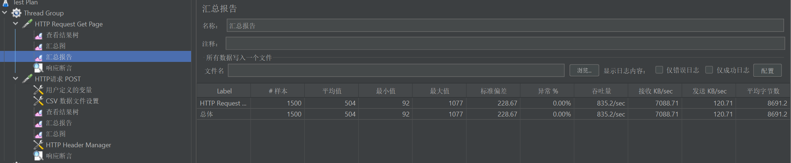
    - Post
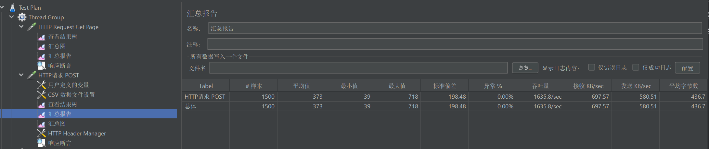

- Normal situation
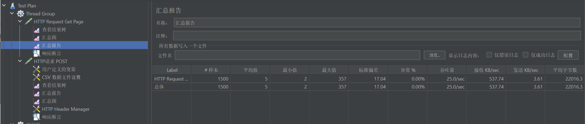

## Container and K8S

- deployment
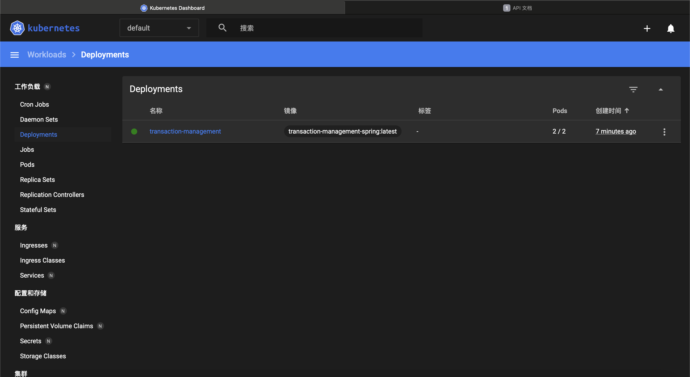
- service
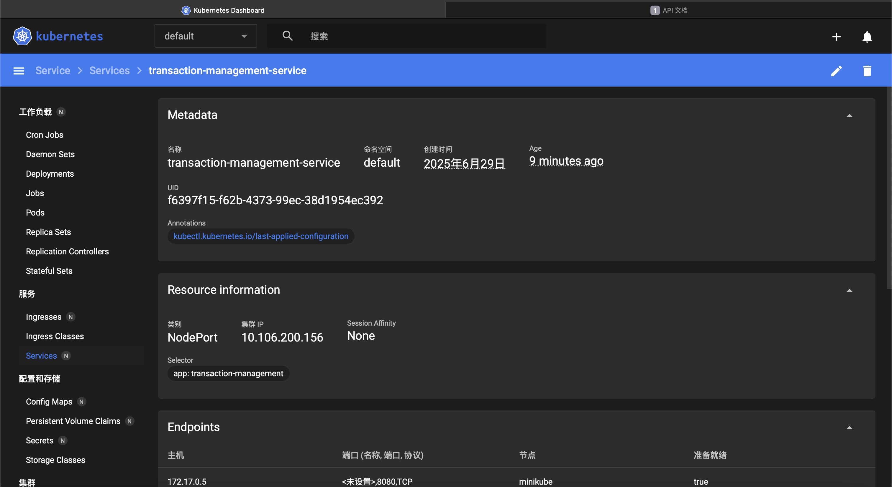
- pod
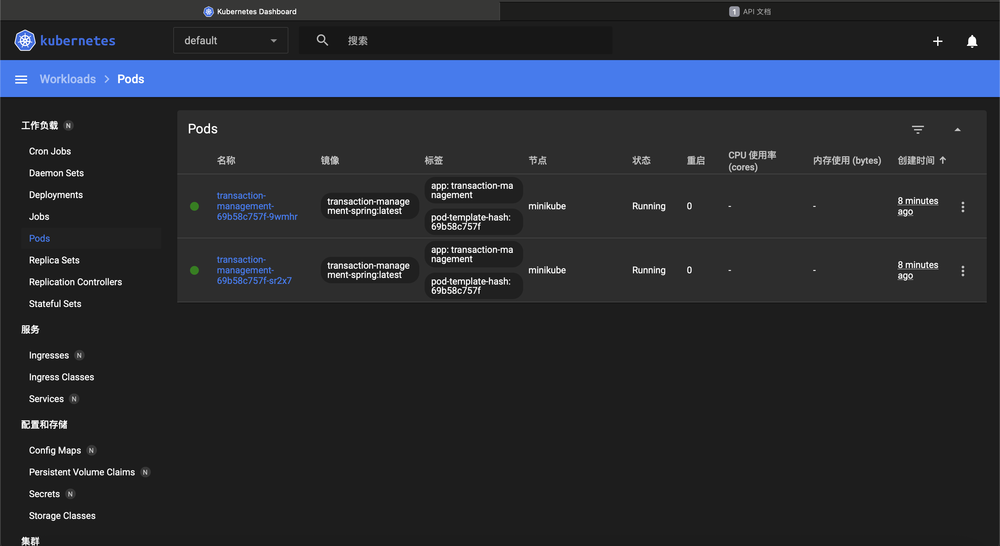
- pod logs
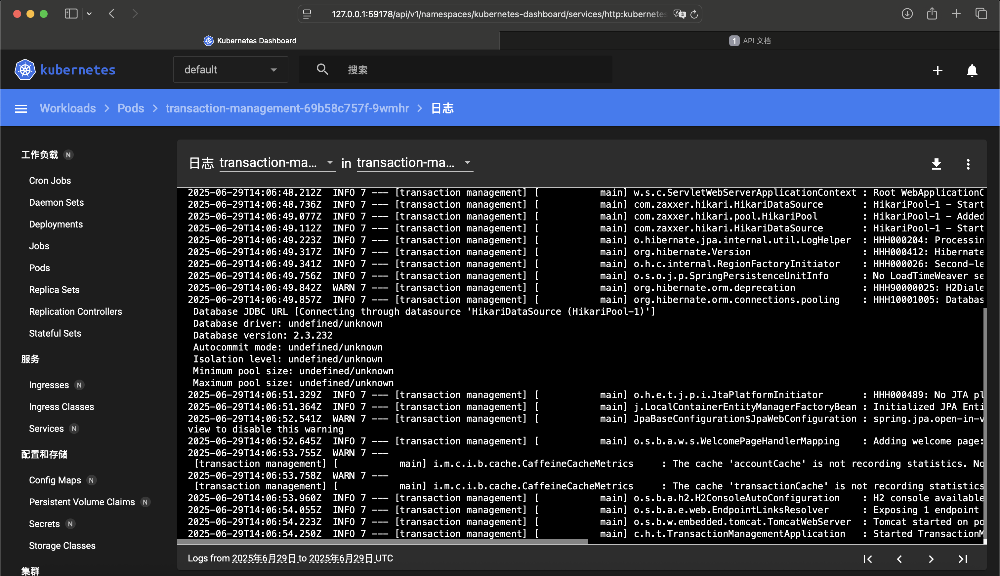
- k8s flow
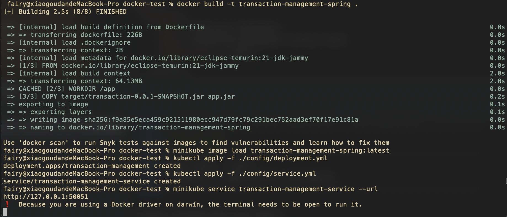
- main page on k8s
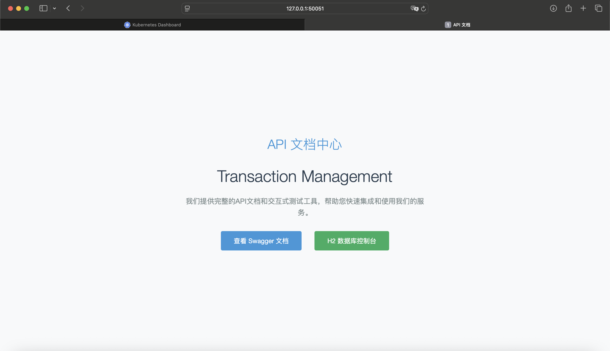
- swagger on k8s
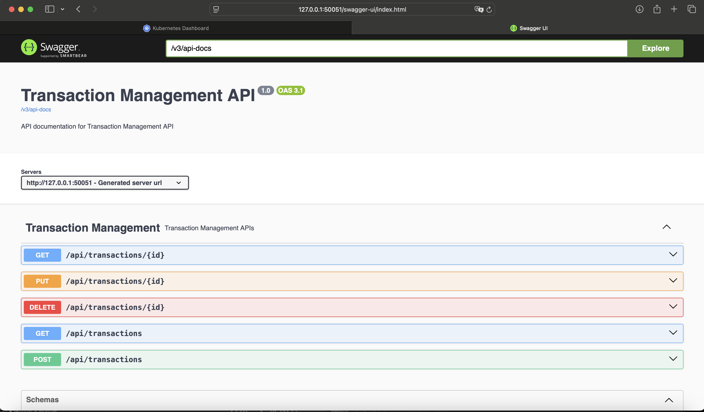
- h2 console on k8s
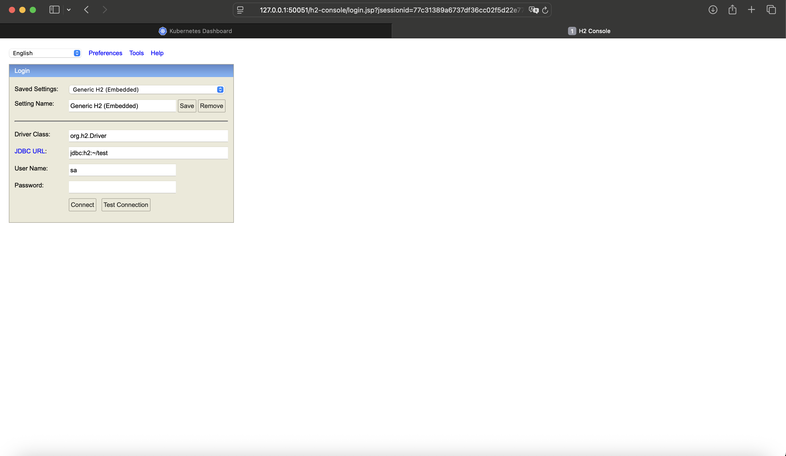